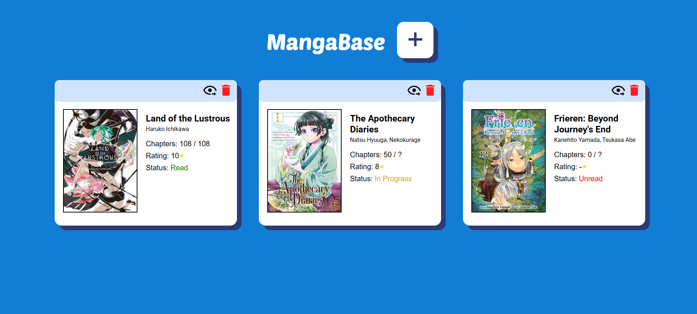

# MangaBase

MangaBase is a library app for avid readers to easily keep track of their favourite manga.

## Features

- The app contains a list of books, which users can add and delete from.
- Each book contains information about its Title, Author, Chapters, Rating, and Read Status.
- Data is saved in between page visits using localStorage.

## Lessons Learned

- Using Objects and Classes in JavaScript
- Dynamic DOM Manipulation
- Working with localStorage

## Next Steps

- Refactor to React
- Allow users to edit book contents
- Enable searching/filtering for books
- Use MyAnimeList API so users can import book lists
- Create a back-end so users can create accounts and share their book lists